# Workspaces MCP Server - Development Plan

**Repository**: https://github.com/nazq/workspaces_mcp.git  
**Initial Branch**: `init` (setup and infrastructure)  
**Main Branch**: `main` (production releases)

## Project Overview

Building a comprehensive developer experience toolkit (dxt) that includes a Model Context Protocol (MCP) server called "Workspaces". This provides automatic context loading and workspace management for Claude Desktop through a seamless installation and setup process.

### Core Components

1. **Workspaces MCP Server**: Core MCP server for context management
2. **DXT Package**: Easy installation and setup toolkit
3. **Claude Desktop Integration**: Automatic configuration and setup

### Core Features

- **Global Instructions**: Auto-loads `GLOBAL.md` from `SHARED_INSTRUCTIONS` folder
- **Shared Instructions**: Manages reusable instruction files for different project types
- **Workspace Management**: Creates and manages project workspaces with their own context
- **Auto-Context Loading**: Leverages Claude Desktop's resource system for automatic context injection
- **One-Command Setup**: `npx dxt-workspaces` installs and configures everything

## Technical Architecture

### Project Structure

```
workspaces_mcp/
├── packages/
│   ├── mcp-server/                  # Core MCP server
│   │   ├── src/
│   │   │   ├── server/
│   │   │   │   ├── index.ts         # Main MCP server entry
│   │   │   │   ├── handlers/
│   │   │   │   │   ├── resources.ts # Resource list/read handlers
│   │   │   │   │   ├── tools.ts     # Tool execution handlers
│   │   │   │   │   └── index.ts     # Handler exports
│   │   │   │   ├── services/
│   │   │   │   │   ├── workspace.ts # Workspace management
│   │   │   │   │   ├── instructions.ts # Shared instructions management
│   │   │   │   │   └── filesystem.ts # File system utilities
│   │   │   │   ├── types/
│   │   │   │   │   ├── workspace.ts # Workspace type definitions
│   │   │   │   │   ├── instructions.ts # Instructions type definitions
│   │   │   │   │   └── index.ts     # Type exports
│   │   │   │   └── config/
│   │   │   │       ├── paths.ts     # Path configuration
│   │   │   │       └── constants.ts # App constants
│   │   │   └── utils/
│   │   │       ├── validation.ts    # Input validation
│   │   │       ├── errors.ts        # Custom error classes
│   │   │       └── templates.ts     # File templates
│   │   ├── tests/
│   │   ├── package.json
│   │   └── tsconfig.json
│   └── dxt-workspaces/              # Developer experience toolkit
│       ├── src/
│       │   ├── index.ts             # Main DXT entry point
│       │   ├── commands/
│       │   │   ├── install.ts       # Installation command
│       │   │   ├── setup.ts         # Setup Claude Desktop config
│       │   │   ├── workspace.ts     # Workspace management
│       │   │   ├── instructions.ts  # Instructions management
│       │   │   └── server.ts        # Server management
│       │   ├── utils/
│       │   │   ├── claude-config.ts # Claude Desktop config management
│       │   │   ├── download.ts      # MCP server binary download
│       │   │   ├── platform.ts      # Cross-platform utilities
│       │   │   └── logger.ts        # Logging utilities
│       │   ├── templates/
│       │   │   ├── global.md        # Default GLOBAL.md template
│       │   │   ├── workspace/       # Workspace templates
│       │   │   └── instructions/    # Instruction templates
│       │   └── types/
│       │       ├── config.ts        # Configuration types
│       │       └── index.ts         # Type exports
│       ├── tests/
│       ├── package.json
│       └── tsconfig.json
├── scripts/
│   ├── build.ts                     # Build all packages
│   ├── build-dxt.ts                 # Build DXT with MCP server embedded
│   ├── dev.ts                       # Development server
│   ├── test.ts                      # Run all tests
│   └── release.ts                   # Prepare release artifacts
├── tests/                           # Integration tests
│   ├── integration/
│   │   ├── full-setup.test.ts       # End-to-end setup testing
│   │   └── claude-integration.test.ts # Claude Desktop integration
│   ├── fixtures/
│   └── helpers/
├── docs/
│   ├── README.md
│   ├── SETUP.md
│   ├── API.md
│   └── DEVELOPMENT.md
├── .github/
│   └── workflows/
│       ├── ci.yml                   # CI pipeline
│       ├── release.yml              # Build and release DXT
│       └── security.yml             # Security scanning
├── package.json                     # Root package.json (workspace config)
├── tsconfig.json                    # Root TypeScript config
├── vitest.config.ts                 # Test configuration
├── eslint.config.js                 # ESLint configuration
├── prettier.config.js               # Prettier configuration
├── .gitignore
└── LICENSE
```

## Phase 1: Project Setup & Infrastructure

### 1.1 Initialize Repository & Branches

- [ ] Clone repository: `git clone https://github.com/nazq/workspaces_mcp.git`
- [ ] Create and switch to init branch: `git checkout -b init`
- [ ] Set up monorepo structure with workspaces
- [ ] Initialize root `package.json` with workspace configuration
- [ ] Create package folders: `packages/mcp-server/` and `packages/dxt-workspaces/`
- [ ] Set up proper `.gitignore` for Node.js, TypeScript, and build artifacts

### 1.2 Development Tooling Setup

#### Root Package.json Configuration (Monorepo) - Latest Versions

```json
{
  "name": "workspaces-mcp-monorepo",
  "version": "1.0.0",
  "private": true,
  "type": "module",
  "workspaces": ["packages/*"],
  "engines": {
    "node": ">=18.0.0",
    "npm": ">=9.0.0"
  },
  "scripts": {
    "build": "tsx scripts/build.ts",
    "build:dxt": "tsx scripts/build-dxt.ts",
    "dev": "tsx scripts/dev.ts",
    "test": "vitest",
    "test:coverage": "vitest --coverage",
    "test:integration": "vitest --config vitest.integration.config.ts",
    "test:ui": "vitest --ui",
    "lint": "eslint packages/*/src/ tests/ --cache",
    "lint:fix": "eslint packages/*/src/ tests/ --fix --cache",
    "format": "prettier --write . --cache",
    "format:check": "prettier --check . --cache",
    "typecheck": "tsc --noEmit --composite false",
    "typecheck:watch": "tsc --noEmit --watch --composite false",
    "clean": "rimraf packages/*/dist dist/ *.tgz node_modules/.cache",
    "clean:deps": "rimraf node_modules packages/*/node_modules",
    "release": "tsx scripts/release.ts",
    "prepare": "husky install",
    "changeset": "changeset",
    "version-packages": "changeset version",
    "ci": "run-s typecheck lint test build",
    "dev:mcp": "tsx watch packages/mcp-server/src/index.ts",
    "dev:dxt": "tsx watch packages/dxt-workspaces/src/index.ts"
  },
  "devDependencies": {
    "@changesets/cli": "^2.27.8",
    "@rollup/plugin-commonjs": "^28.0.0",
    "@rollup/plugin-json": "^6.1.0",
    "@rollup/plugin-node-resolve": "^15.3.0",
    "@rollup/plugin-replace": "^6.0.1",
    "@rollup/plugin-terser": "^0.4.4",
    "@rollup/plugin-typescript": "^12.1.0",
    "@typescript-eslint/eslint-plugin": "^8.8.0",
    "@typescript-eslint/parser": "^8.8.0",
    "@types/node": "^22.7.4",
    "@vitest/coverage-v8": "^2.1.1",
    "@vitest/ui": "^2.1.1",
    "c8": "^10.1.2",
    "concurrently": "^9.0.1",
    "cross-env": "^7.0.3",
    "eslint": "^9.11.1",
    "eslint-plugin-import": "^2.30.0",
    "eslint-plugin-node": "^11.1.0",
    "eslint-plugin-unicorn": "^55.0.0",
    "husky": "^9.1.6",
    "lint-staged": "^15.2.10",
    "nodemon": "^3.1.7",
    "npm-run-all2": "^6.2.3",
    "prettier": "^3.3.3",
    "prettier-plugin-organize-imports": "^4.1.0",
    "rimraf": "^6.0.1",
    "rollup": "^4.22.4",
    "semantic-release": "^24.2.0",
    "tsx": "^4.19.1",
    "typescript": "^5.6.2",
    "vitest": "^2.1.1"
  },
  "lint-staged": {
    "*.{ts,tsx,js,jsx}": ["eslint --fix", "prettier --write"],
    "*.{json,md,yml,yaml}": ["prettier --write"]
  }
}
```

#### MCP Server Package.json - Latest Versions

```json
{
  "name": "@workspaces-mcp/server",
  "version": "1.0.0",
  "type": "module",
  "exports": {
    ".": {
      "import": "./dist/index.js",
      "types": "./dist/index.d.ts"
    }
  },
  "bin": {
    "workspaces-mcp-server": "./dist/index.js"
  },
  "engines": {
    "node": ">=18.0.0"
  },
  "dependencies": {
    "@modelcontextprotocol/sdk": "^1.0.3",
    "chokidar": "^4.0.1",
    "fs-extra": "^11.2.0",
    "zod": "^3.23.8"
  },
  "devDependencies": {
    "@types/fs-extra": "^11.0.4"
  }
}
```

#### DXT Package.json - Latest Versions

```json
{
  "name": "dxt-workspaces",
  "version": "1.0.0",
  "type": "module",
  "exports": {
    ".": {
      "import": "./dist/index.js",
      "types": "./dist/index.d.ts"
    }
  },
  "bin": {
    "dxt-workspaces": "./dist/index.js"
  },
  "engines": {
    "node": ">=18.0.0"
  },
  "keywords": [
    "mcp",
    "claude",
    "workspace",
    "context",
    "ai",
    "developer-tools",
    "cli"
  ],
  "dependencies": {
    "chalk": "^5.3.0",
    "commander": "^12.1.0",
    "extract-zip": "^2.0.1",
    "inquirer": "^10.1.8",
    "node-fetch": "^3.3.2",
    "ora": "^8.1.0",
    "semver": "^7.6.3"
  },
  "devDependencies": {
    "@types/extract-zip": "^2.0.1",
    "@types/inquirer": "^9.0.7",
    "@types/semver": "^7.5.8"
  }
}
```

#### Modern ESLint Configuration (Flat Config - Latest)

```javascript
// eslint.config.js
import typescriptEslint from '@typescript-eslint/eslint-plugin';
import typescriptParser from '@typescript-eslint/parser';
import importPlugin from 'eslint-plugin-import';
import nodePlugin from 'eslint-plugin-node';
import unicornPlugin from 'eslint-plugin-unicorn';

export default [
  {
    ignores: [
      'dist/**',
      'node_modules/**',
      'coverage/**',
      '*.config.js',
      '.github/**',
    ],
  },
  {
    files: ['**/*.{ts,tsx,js,jsx}'],
    languageOptions: {
      parser: typescriptParser,
      parserOptions: {
        ecmaVersion: 'latest',
        sourceType: 'module',
        project: './tsconfig.json',
      },
    },
    plugins: {
      '@typescript-eslint': typescriptEslint,
      import: importPlugin,
      node: nodePlugin,
      unicorn: unicornPlugin,
    },
    rules: {
      // TypeScript rules (latest)
      '@typescript-eslint/no-unused-vars': [
        'error',
        { argsIgnorePattern: '^_' },
      ],
      '@typescript-eslint/no-explicit-any': 'warn',
      '@typescript-eslint/explicit-function-return-type': 'off',
      '@typescript-eslint/explicit-module-boundary-types': 'off',
      '@typescript-eslint/no-non-null-assertion': 'warn',
      '@typescript-eslint/prefer-nullish-coalescing': 'error',
      '@typescript-eslint/prefer-optional-chain': 'error',
      '@typescript-eslint/strict-boolean-expressions': 'error',

      // Import/Export rules
      'import/order': [
        'error',
        {
          groups: [
            'builtin',
            'external',
            'internal',
            'parent',
            'sibling',
            'index',
          ],
          'newlines-between': 'always',
          alphabetize: { order: 'asc' },
        },
      ],
      'import/no-default-export': 'warn',
      'import/prefer-default-export': 'off',

      // Modern JavaScript rules
      'unicorn/prefer-module': 'error',
      'unicorn/prefer-node-protocol': 'error',
      'unicorn/no-array-callback-reference': 'off',
      'unicorn/prevent-abbreviations': 'off',

      // Node.js specific
      'node/no-missing-import': 'off', // Handled by TypeScript
      'node/no-unsupported-features/es-syntax': 'off', // We use modern syntax

      // General code quality
      'prefer-const': 'error',
      'no-var': 'error',
      'object-shorthand': 'error',
      'prefer-arrow-callback': 'error',
      'prefer-template': 'error',
    },
  },
];
```

#### TypeScript Configuration (Latest Strict)

```json
{
  "compilerOptions": {
    "target": "ES2023",
    "module": "ESNext",
    "moduleResolution": "bundler",
    "allowSyntheticDefaultImports": true,
    "esModuleInterop": true,
    "allowJs": true,
    "strict": true,
    "noUncheckedIndexedAccess": true,
    "exactOptionalPropertyTypes": true,
    "noImplicitReturns": true,
    "noFallthroughCasesInSwitch": true,
    "noUncheckedSideEffectImports": true,
    "noImplicitOverride": true,
    "useDefineForClassFields": true,
    "declaration": true,
    "declarationMap": true,
    "outDir": "./dist",
    "rootDir": "./src",
    "sourceMap": true,
    "skipLibCheck": true,
    "forceConsistentCasingInFileNames": true,
    "resolveJsonModule": true,
    "isolatedModules": true,
    "verbatimModuleSyntax": true,
    "allowImportingTsExtensions": false,
    "composite": true,
    "incremental": true,
    "tsBuildInfoFile": "./node_modules/.cache/tsbuildinfo"
  },
  "include": ["src/**/*"],
  "exclude": ["node_modules", "dist", "tests"],
  "references": []
}
```

#### Vitest Configuration (Latest Features)

```typescript
// vitest.config.ts
import { defineConfig } from 'vitest/config';

export default defineConfig({
  test: {
    globals: true,
    environment: 'node',
    coverage: {
      provider: 'v8',
      reporter: ['text', 'json', 'html', 'lcov'],
      exclude: [
        'node_modules/',
        'dist/',
        'coverage/',
        '**/*.config.*',
        '**/*.d.ts',
        'tests/fixtures/**',
        'scripts/**',
      ],
      thresholds: {
        global: {
          branches: 90,
          functions: 90,
          lines: 90,
          statements: 90,
        },
      },
    },
    include: ['tests/**/*.test.ts', 'packages/*/tests/**/*.test.ts'],
    exclude: ['node_modules', 'dist', 'cypress'],
    watchExclude: ['node_modules', 'dist'],
    poolOptions: {
      threads: {
        singleThread: false,
      },
    },
    testTimeout: 10000,
    hookTimeout: 10000,
    teardownTimeout: 5000,
    isolate: true,
    passWithNoTests: true,
    logHeapUsage: true,
    allowOnly: process.env.CI !== 'true',
    reporter: process.env.CI ? ['verbose', 'github-actions'] : ['verbose'],
    outputFile: {
      junit: './coverage/junit.xml',
    },
  },
});
```

### 1.3 GitHub Actions CI/CD

#### CI Pipeline (`.github/workflows/ci.yml`)

- [ ] **Linting & Formatting**: ESLint, Prettier checks
- [ ] **Type Checking**: TypeScript compilation for all packages
- [ ] **Testing**: Unit and integration tests with coverage
- [ ] **Build Verification**: Build both MCP server and DXT
- [ ] **Node.js Matrix**: Test on Node 18, 20, 22
- [ ] **OS Matrix**: Test on Ubuntu, macOS, Windows

#### Release Pipeline (`.github/workflows/release.yml`)

- [ ] **Build Artifacts**: Build MCP server binary and DXT package
- [ ] **Package DXT**: Embed MCP server binary into DXT
- [ ] **Create Release Assets**:
  - `dxt-workspaces-linux-x64.tar.gz`
  - `dxt-workspaces-darwin-x64.tar.gz`
  - `dxt-workspaces-darwin-arm64.tar.gz`
  - `dxt-workspaces-win32-x64.zip`
- [ ] **GitHub Release**: Auto-generated release with assets
- [ ] **NPM Publishing**: Publish DXT package to NPM
- [ ] **Version Tagging**: Semantic release with proper tags

```yaml
# .github/workflows/release.yml
name: Release
on:
  push:
    branches: [main]
    tags: ['v*']

jobs:
  build-and-release:
    runs-on: ubuntu-latest
    steps:
      - uses: actions/checkout@v4
      - uses: actions/setup-node@v4
        with:
          node-version: '20'

      - name: Install dependencies
        run: npm ci

      - name: Build packages
        run: npm run build

      - name: Build DXT with embedded MCP server
        run: npm run build:dxt

      - name: Create platform-specific packages
        run: npm run release

      - name: Create GitHub Release
        uses: softprops/action-gh-release@v1
        with:
          files: |
            dist/dxt-workspaces-*.tar.gz
            dist/dxt-workspaces-*.zip
        env:
          GITHUB_TOKEN: ${{ secrets.GITHUB_TOKEN }}
```

#### Security Pipeline (`.github/workflows/security.yml`)

- [ ] **Dependency Scanning**: npm audit, Snyk
- [ ] **SAST Analysis**: CodeQL scanning
- [ ] **License Checking**: License compatibility

## Phase 2: Core MCP Server Implementation

### 2.1 Base Server Setup

- [ ] Initialize MCP Server with proper configuration
- [ ] Set up error handling and logging
- [ ] Create base handler structure
- [ ] Implement health check endpoint

### 2.2 Resource Management System

#### Global Instructions Handler

```typescript
// src/handlers/resources.ts
export async function listResources(): Promise<ListResourcesResult> {
  const resources: Resource[] = [];

  // Always include GLOBAL.md as first resource for auto-loading
  resources.push({
    uri: 'file://shared/GLOBAL.md',
    name: '🌍 Global Instructions',
    description:
      '⭐ Essential global instructions - loads automatically for all sessions',
    mimeType: 'text/markdown',
  });

  // Add shared instructions
  await addSharedInstructionResources(resources);

  // Add workspace resources
  await addWorkspaceResources(resources);

  return { resources };
}
```

#### Resource Content Provider

- [ ] Implement `ReadResourceRequestSchema` handler
- [ ] Template generation for missing files
- [ ] Error handling for inaccessible resources
- [ ] Content caching for performance

### 2.3 Workspace Management Service

#### Workspace Operations

```typescript
// src/services/workspace.ts
export interface WorkspaceService {
  createWorkspace(name: string, template?: string): Promise<Workspace>;
  listWorkspaces(): Promise<Workspace[]>;
  getWorkspaceInfo(name: string): Promise<Workspace>;
  deleteWorkspace(name: string): Promise<void>;
  addFileToWorkspace(workspaceName: string, filePath: string): Promise<void>;
}
```

### 2.4 Shared Instructions Management

#### Instructions Service

```typescript
// src/services/instructions.ts
export interface InstructionsService {
  createSharedInstruction(name: string, content: string): Promise<void>;
  updateGlobalInstructions(content: string): Promise<void>;
  listSharedInstructions(): Promise<SharedInstruction[]>;
  getSharedInstruction(name: string): Promise<SharedInstruction>;
  deleteSharedInstruction(name: string): Promise<void>;
}
```

### 2.5 Tool Implementation

#### MCP Tools

- [ ] `create_workspace` - Create new workspace
- [ ] `list_workspaces` - List available workspaces
- [ ] `create_shared_instruction` - Create shared instruction file
- [ ] `update_global_instructions` - Update global instructions
- [ ] `get_workspace_info` - Get workspace details
- [ ] `add_workspace_file` - Add file to workspace

## Phase 3: Advanced Features

### 3.1 Template System

- [ ] Workspace templates (React, Python, Node.js, etc.)
- [ ] Instruction templates for common use cases
- [ ] User-defined custom templates
- [ ] Template validation and testing

### 3.2 Configuration Management

- [ ] User preferences and settings
- [ ] Custom workspace root paths
- [ ] Auto-loading preferences
- [ ] Claude Desktop integration settings

### 3.3 File Watching & Updates

- [ ] Watch for changes in workspace files
- [ ] Auto-refresh resources when files change
- [ ] Conflict resolution for concurrent edits
- [ ] Backup and versioning support

## Phase 4: DXT (Developer Experience Toolkit) Development

### 4.1 DXT Core Features

```typescript
// packages/dxt-workspaces/src/index.ts
import { Command } from 'commander';

const program = new Command();

program
  .name('dxt-workspaces')
  .description('Workspaces MCP Developer Experience Toolkit')
  .version('1.0.0');

program
  .command('install')
  .description('Install and setup Workspaces MCP for Claude Desktop')
  .option('--path <path>', 'Custom workspaces directory path')
  .action(handleInstall);

program
  .command('setup')
  .description('Configure Claude Desktop integration')
  .action(handleSetup);

program
  .command('workspace <command>')
  .description('Workspace management commands')
  .action(handleWorkspaceCommands);
```

### 4.2 Installation & Setup System

#### Auto-Installation Process

```typescript
// packages/dxt-workspaces/src/commands/install.ts
export async function handleInstall(options: InstallOptions): Promise<void> {
  const spinner = ora('Setting up Workspaces MCP...').start();

  try {
    // 1. Create workspaces directory structure
    await createWorkspacesStructure(options.path);

    // 2. Extract embedded MCP server binary
    await extractMCPServer();

    // 3. Setup Claude Desktop configuration
    await setupClaudeDesktopConfig();

    // 4. Create default GLOBAL.md
    await createDefaultGlobalInstructions();

    // 5. Verify installation
    await verifyInstallation();

    spinner.succeed('Workspaces MCP installed successfully!');

    console.log(chalk.green('\n✅ Setup complete! Next steps:'));
    console.log('1. Restart Claude Desktop');
    console.log('2. Look for "🌍 Global Instructions" in resources');
    console.log('3. Click to load your global context');
    console.log(`4. Edit global instructions: ${getGlobalInstructionsPath()}`);
  } catch (error) {
    spinner.fail('Installation failed');
    console.error(chalk.red(error.message));
    process.exit(1);
  }
}
```

#### Claude Desktop Config Management

```typescript
// packages/dxt-workspaces/src/utils/claude-config.ts
interface ClaudeDesktopConfig {
  mcpServers: Record<string, MCPServerConfig>;
}

interface MCPServerConfig {
  command: string;
  args?: string[];
  env?: Record<string, string>;
}

export async function setupClaudeDesktopConfig(): Promise<void> {
  const configPath = getClaudeDesktopConfigPath();
  const mcpServerPath = getMCPServerBinaryPath();

  let config: ClaudeDesktopConfig = { mcpServers: {} };

  // Read existing config if it exists
  try {
    const existingConfig = await fs.readFile(configPath, 'utf-8');
    config = JSON.parse(existingConfig);
  } catch {
    // Config doesn't exist, will create new one
  }

  // Add workspaces MCP server
  config.mcpServers.workspaces = {
    command: mcpServerPath,
    args: [],
    env: {
      WORKSPACES_ROOT: getWorkspacesRoot(),
    },
  };

  // Ensure config directory exists
  await fs.ensureDir(path.dirname(configPath));

  // Write updated config
  await fs.writeFile(configPath, JSON.stringify(config, null, 2));
}
```

### 4.3 DXT Build System

#### Embedding MCP Server in DXT

```typescript
// scripts/build-dxt.ts
import { rollup } from 'rollup';
import typescript from '@rollup/plugin-typescript';
import resolve from '@rollup/plugin-node-resolve';
import commonjs from '@rollup/plugin-commonjs';

export async function buildDXT(): Promise<void> {
  // 1. Build MCP server as standalone binary
  await buildMCPServerBinary();

  // 2. Build DXT with embedded server
  const bundle = await rollup({
    input: 'packages/dxt-workspaces/src/index.ts',
    plugins: [
      typescript(),
      resolve({ preferBuiltins: true }),
      commonjs(),
      // Embed MCP server binary as base64
      embedBinary({
        'mcp-server-binary': 'packages/mcp-server/dist/server.js',
      }),
    ],
    external: ['node:fs', 'node:path', 'node:os', 'node:process'],
  });

  // 3. Generate platform-specific packages
  await generatePlatformPackages(bundle);
}

async function generatePlatformPackages(bundle: RollupBundle): Promise<void> {
  const platforms = [
    { platform: 'linux', arch: 'x64' },
    { platform: 'darwin', arch: 'x64' },
    { platform: 'darwin', arch: 'arm64' },
    { platform: 'win32', arch: 'x64' },
  ];

  for (const { platform, arch } of platforms) {
    const outputDir = `dist/dxt-workspaces-${platform}-${arch}`;

    await bundle.write({
      file: `${outputDir}/dxt-workspaces${platform === 'win32' ? '.exe' : ''}`,
      format: 'esm',
      banner: '#!/usr/bin/env node',
    });

    // Create archive
    const archiveName = `dxt-workspaces-${platform}-${arch}.${platform === 'win32' ? 'zip' : 'tar.gz'}`;
    await createArchive(outputDir, `dist/${archiveName}`);
  }
}
```

### 4.4 DXT Commands

#### Workspace Management

- [ ] `dxt-workspaces install` - Complete setup and installation
- [ ] `dxt-workspaces workspace create <n>` - Create new workspace
- [ ] `dxt-workspaces workspace list` - List all workspaces
- [ ] `dxt-workspaces workspace open <n>` - Open workspace in file manager
- [ ] `dxt-workspaces instructions create <n>` - Create shared instruction
- [ ] `dxt-workspaces instructions edit <n>` - Edit shared instruction
- [ ] `dxt-workspaces config show` - Show current configuration
- [ ] `dxt-workspaces config reset` - Reset to defaults
- [ ] `dxt-workspaces update` - Update MCP server and DXT

#### Interactive Setup

```typescript
// packages/dxt-workspaces/src/commands/setup.ts
export async function interactiveSetup(): Promise<void> {
  console.log(chalk.blue('🚀 Workspaces MCP Interactive Setup\n'));

  const answers = await inquirer.prompt([
    {
      type: 'input',
      name: 'workspacesPath',
      message: 'Where should workspaces be stored?',
      default: path.join(os.homedir(), 'Documents', 'workspaces'),
    },
    {
      type: 'confirm',
      name: 'createExamples',
      message: 'Create example workspace and instructions?',
      default: true,
    },
    {
      type: 'confirm',
      name: 'autoStartServer',
      message: 'Automatically start MCP server on system boot?',
      default: false,
    },
  ]);

  await processSetupAnswers(answers);
}
```

## Phase 5: Testing Strategy

### 5.1 Unit Testing

- [ ] **Services Testing**: Workspace and instructions services
- [ ] **Handlers Testing**: MCP request handlers
- [ ] **Utilities Testing**: Helper functions and validation
- [ ] **Error Handling**: Custom error classes and edge cases

### 5.2 Integration Testing

- [ ] **MCP Protocol Testing**: Full MCP server integration
- [ ] **Filesystem Operations**: File system interactions
- [ ] **CLI Integration**: End-to-end CLI testing
- [ ] **Resource Loading**: Resource discovery and loading

### 5.3 Test Infrastructure

```typescript
// tests/helpers/test-server.ts
export class TestMCPServer {
  private server: Server;
  private testDir: string;

  async setup(): Promise<void> {
    this.testDir = await fs.mkdtemp(path.join(os.tmpdir(), 'workspaces-test-'));
    this.server = createWorkspacesServer(this.testDir);
  }

  async cleanup(): Promise<void> {
    await fs.rm(this.testDir, { recursive: true });
  }
}
```

### 5.4 Test Coverage Goals

- [ ] **95%+ Code Coverage**: Comprehensive test coverage
- [ ] **Edge Case Testing**: Error conditions and boundary cases
- [ ] **Performance Testing**: Resource loading performance
- [ ] **Security Testing**: Path traversal and injection attacks

## Phase 6: Documentation & User Experience

### 6.1 Beautiful README with GitHub Badges

Create a stunning README.md with comprehensive badges and visual appeal:

````markdown
<div align="center">

# 🚀 Workspaces MCP

**Intelligent workspace and context management for Claude Desktop**

[](https://github.com/nazq/workspaces_mcp/releases)
[](https://www.npmjs.com/package/dxt-workspaces)
[](https://www.npmjs.com/package/dxt-workspaces)

[](https://github.com/nazq/workspaces_mcp/actions)
[](https://codecov.io/gh/nazq/workspaces_mcp)
[](https://sonarcloud.io/dashboard?id=nazq_workspaces_mcp)

[](https://www.typescriptlang.org/)
[](https://nodejs.org/)
[](LICENSE)

[](#installation)
[](https://modelcontextprotocol.io/)

---

**✨ One command setup** • **🌍 Auto-loading context** • **📁 Smart workspaces** • **🔧 Zero configuration**

[🚀 Quick Start](#quick-start) • [📖 Documentation](#documentation) • [🛠️ Development](#development) • [💬 Community](#community)

</div>

## 🌟 Features

<table>
<tr>
<td>

### 🌍 **Global Context**

- Auto-loads `GLOBAL.md` in every Claude session
- Persistent instructions across all projects
- Customizable global preferences

</td>
<td>

### 📁 **Smart Workspaces**

- Project-specific context management
- File organization and tracking
- Template-based workspace creation

</td>
</tr>
<tr>
<td>

### 🔧 **Zero Configuration**

- One-command installation
- Auto-configures Claude Desktop
- Cross-platform compatibility

</td>
<td>

### 🚀 **Developer Experience**

- Modern CLI with interactive prompts
- Rich template system
- Comprehensive error handling

</td>
</tr>
</table>

## 🚀 Quick Start

### One-Line Installation

```bash
# Install and setup everything automatically
npx dxt-workspaces install
```
````

That's it! 🎉 Restart Claude Desktop and look for **🌍 Global Instructions** in your resources.

### Alternative Installation Methods

<details>
<summary>📦 Install globally via NPM</summary>

```bash
npm install -g dxt-workspaces
dxt-workspaces install
```

</details>

<details>
<summary>⬇️ Download pre-built binaries</summary>

Download the latest release for your platform:

- [🐧 Linux x64](https://github.com/nazq/workspaces_mcp/releases/latest/download/dxt-workspaces-linux-x64.tar.gz)
- [🍎 macOS Intel](https://github.com/nazq/workspaces_mcp/releases/latest/download/dxt-workspaces-darwin-x64.tar.gz)
- [🍎 macOS Apple Silicon](https://github.com/nazq/workspaces_mcp/releases/latest/download/dxt-workspaces-darwin-arm64.tar.gz)
- [🪟 Windows x64](https://github.com/nazq/workspaces_mcp/releases/latest/download/dxt-workspaces-win32-x64.zip)

Extract and run:

```bash
./dxt-workspaces install
```

</details>

## 🎯 How It Works

```mermaid
graph TB
    A[🚀 Run dxt-workspaces install] --> B[📁 Creates workspace structure]
    B --> C[⚡ Installs MCP server]
    C --> D[⚙️ Configures Claude Desktop]
    D --> E[📝 Creates GLOBAL.md template]
    E --> F[✅ Ready to use!]

    F --> G[🌍 Auto-loads in Claude]
    G --> H[📋 Provides context]
    H --> I[🧠 Enhanced AI assistance]
```

<div align="center">



</div>

### Directory Structure Created

```
📁 ~/Documents/workspaces/
├── 📁 SHARED_INSTRUCTIONS/
│   ├── 📄 GLOBAL.md                 # 🌍 Auto-loaded in every session
│   ├── 📄 react-project.md          # Shared React instructions
│   └── 📄 python-data.md            # Shared Python/Data instructions
├── 📁 my-react-app/                 # Your workspaces
│   ├── 📄 src/components/...
│   └── 📄 package.json
└── 📁 data-analysis-project/
    ├── 📄 notebooks/...
    └── 📄 requirements.txt
```

## 💻 Usage

### Managing Global Instructions

```bash
# Edit global instructions that auto-load in every Claude session
dxt-workspaces instructions edit global

# View current global instructions
dxt-workspaces instructions show global
```

### Workspace Management

```bash
# Create a new workspace
dxt-workspaces workspace create my-project

# List all workspaces
dxt-workspaces workspace list

# Open workspace in file manager
dxt-workspaces workspace open my-project
```

### Shared Instructions

```bash
# Create shared instructions for specific project types
dxt-workspaces instructions create react-typescript

# List all shared instructions
dxt-workspaces instructions list

# Edit shared instructions
dxt-workspaces instructions edit react-typescript
```

## 📖 Documentation

| Topic                  | Description                               | Link                                          |
| ---------------------- | ----------------------------------------- | --------------------------------------------- |
| 🚀 **Setup Guide**     | Detailed installation and configuration   | [SETUP.md](docs/SETUP.md)                     |
| 🔌 **API Reference**   | MCP server API documentation              | [API.md](docs/API.md)                         |
| 🛠️ **Development**     | Contributing and development guide        | [DEVELOPMENT.md](docs/DEVELOPMENT.md)         |
| 📝 **Best Practices**  | Tips for effective workspace organization | [BEST_PRACTICES.md](docs/BEST_PRACTICES.md)   |
| 🔧 **Troubleshooting** | Common issues and solutions               | [TROUBLESHOOTING.md](docs/TROUBLESHOOTING.md) |

## 🛠️ Development

This project uses modern development practices with TypeScript, comprehensive testing, and automated CI/CD.

### Prerequisites

- Node.js 18+
- npm 9+

### Development Setup

```bash
# Clone the repository
git clone https://github.com/nazq/workspaces_mcp.git
cd workspaces_mcp

# Install dependencies
npm install

# Start development server
npm run dev

# Run tests
npm test

# Build for production
npm run build
```

### Project Structure

This is a monorepo containing:

- **`packages/mcp-server/`** - Core MCP server implementation
- **`packages/dxt-workspaces/`** - Developer experience toolkit (CLI)

### Contributing

We welcome contributions! Please see our [Contributing Guide](CONTRIBUTING.md) for details.

1. Fork the repository
2. Create a feature branch: `git checkout -b feature/amazing-feature`
3. Commit your changes: `git commit -m 'Add amazing feature'`
4. Push to the branch: `git push origin feature/amazing-feature`
5. Open a Pull Request

## 📊 Stats & Analytics

<div align="center">

[](https://github.com/nazq/workspaces_mcp)

[](https://github.com/nazq/workspaces_mcp)

</div>

## 🔐 Security

Security is a top priority. This project includes:

- 🛡️ Input validation and sanitization
- 🔒 Path traversal protection
- 🔍 Dependency vulnerability scanning
- 📋 Security audit logging

Found a security issue? Please report it privately to [security@yourdomain.com](mailto:security@yourdomain.com).

## 📄 License

This project is licensed under the MIT License - see the [LICENSE](LICENSE) file for details.

## 🙏 Acknowledgments

- [Model Context Protocol](https://modelcontextprotocol.io/) - The protocol that makes this possible
- [Claude Desktop](https://claude.ai/) - The AI assistant this integrates with
- [Anthropic](https://anthropic.com/) - For creating Claude and the MCP standard

## 💬 Community

<div align="center">

[](https://github.com/nazq/workspaces_mcp/discussions)
[](https://discord.gg/YOUR_INVITE)
[](https://twitter.com/YOUR_TWITTER)

**Join our community to share workspaces, get help, and contribute!**

[💬 Discussions](https://github.com/nazq/workspaces_mcp/discussions) • [🐛 Report Bug](https://github.com/nazq/workspaces_mcp/issues) • [💡 Request Feature](https://github.com/nazq/workspaces_mcp/issues/new?template=feature_request.md)

</div>

---

<div align="center">

**⭐ Star this repo if it helps you manage your Claude Desktop workspaces!**

Made with ❤️ by [nazq](https://github.com/nazq)

</div>
```

### 6.2 User Experience Documentation

#### One-Command Installation

```bash
# Install globally via NPM
npm install -g dxt-workspaces

# Or run directly with npx
npx dxt-workspaces install

# Or download platform-specific binary from GitHub releases
curl -L https://github.com/nazq/workspaces_mcp/releases/latest/download/dxt-workspaces-linux-x64.tar.gz | tar -xz
./dxt-workspaces install
```

#### Claude Desktop Setup Guide

````markdown
# Workspaces MCP Setup

## Quick Start (Recommended)

```bash
npx dxt-workspaces install
```
````

This single command will:

1. ✅ Create your workspaces directory structure
2. ✅ Install the MCP server binary
3. ✅ Configure Claude Desktop automatically
4. ✅ Create your first GLOBAL.md template
5. ✅ Verify everything is working

## Manual Setup

If you prefer manual installation:

1. Download the latest release for your platform from [GitHub Releases](https://github.com/nazq/workspaces_mcp/releases)
2. Extract and run: `./dxt-workspaces install`
3. Restart Claude Desktop
4. Look for "🌍 Global Instructions" in your resources panel
5. Click to load your global context automatically

## Post-Installation

1. Edit your global instructions: `dxt-workspaces instructions edit global`
2. Create your first workspace: `dxt-workspaces workspace create my-project`
3. Add shared instructions: `dxt-workspaces instructions create react-project`

## Verification

Run `dxt-workspaces config show` to verify your setup.

````

### 6.3 Best Practices Documentation
- [ ] Workspace organization patterns
- [ ] Effective global instructions writing
- [ ] Performance optimization tips
- [ ] Security considerations

## Phase 7: Performance & Security

### 7.1 Performance Optimization
- [ ] **Resource Caching**: Cache frequently accessed resources
- [ ] **Lazy Loading**: Load workspace contents on demand
- [ ] **File Watching Efficiency**: Optimize file system watching
- [ ] **Memory Management**: Efficient memory usage patterns

### 7.2 Security Hardening
- [ ] **Path Traversal Protection**: Prevent directory traversal attacks
- [ ] **Input Validation**: Comprehensive input sanitization
- [ ] **File Permission Checks**: Proper file access validation
- [ ] **Audit Logging**: Security event logging

### 7.3 Error Handling
```typescript
// src/utils/errors.ts
export class WorkspaceError extends Error {
  constructor(
    message: string,
    public readonly code: string,
    public readonly cause?: Error
  ) {
    super(message);
    this.name = 'WorkspaceError';
  }
}

export class InvalidWorkspaceNameError extends WorkspaceError {
  constructor(name: string) {
    super(`Invalid workspace name: ${name}`, 'INVALID_WORKSPACE_NAME');
  }
}
````

## Development Standards & Quality Gates

### Code Quality Requirements

- [ ] **TypeScript Strict Mode**: Full type safety
- [ ] **ESLint Clean**: Zero linting errors
- [ ] **Prettier Formatted**: Consistent code formatting
- [ ] **Test Coverage**: 95%+ coverage requirement
- [ ] **No TODOs in Main**: Clean production code
- [ ] **Documentation Complete**: All public APIs documented

### Git Workflow

- [ ] **Feature Branches**: All work in feature branches
- [ ] **PR Reviews**: Required code reviews
- [ ] **Conventional Commits**: Semantic commit messages
- [ ] **CI Passing**: All checks must pass
- [ ] **Linear History**: Clean git history

### Release Process

1. **Version Bump**: Semantic versioning
2. **Changelog Update**: Auto-generated release notes
3. **Testing**: Full test suite execution
4. **Build Verification**: Clean production build
5. **NPM Publishing**: Automated package release
6. **GitHub Release**: Tagged release with notes

## Dependencies & Technology Stack

### Latest Package Versions (as of August 2025)

#### Core Dependencies (MCP Server)

- `@modelcontextprotocol/sdk: ^1.0.3` - Latest MCP SDK
- `fs-extra: ^11.2.0` - Enhanced filesystem operations
- `chokidar: ^4.0.1` - File system watching (latest)
- `zod: ^3.23.8` - Runtime type validation (latest)

#### Core Dependencies (DXT)

- `commander: ^12.1.0` - CLI framework (latest)
- `chalk: ^5.3.0` - Terminal colors (latest ESM)
- `inquirer: ^10.1.8` - Interactive prompts (latest ESM)
- `ora: ^8.1.0` - Loading spinners (latest ESM)
- `node-fetch: ^3.3.2` - HTTP requests (latest ESM)
- `extract-zip: ^2.0.1` - Archive extraction
- `semver: ^7.6.3` - Version management (latest)

#### Development Dependencies (Latest Versions)

- `typescript: ^5.6.2` - TypeScript compiler (latest)
- `tsx: ^4.19.1` - TypeScript execution (latest)
- `vitest: ^2.1.1` - Testing framework (latest)
- `@vitest/coverage-v8: ^2.1.1` - Coverage reporting (v8 engine, latest)
- `@vitest/ui: ^2.1.1` - Test UI (latest)
- `eslint: ^9.11.1` - Linting (latest flat config)
- `@typescript-eslint/eslint-plugin: ^8.8.0` - TypeScript ESLint (latest)
- `@typescript-eslint/parser: ^8.8.0` - TypeScript parser (latest)
- `prettier: ^3.3.3` - Code formatting (latest)
- `@types/node: ^22.7.4` - Node.js types (latest for Node 22)

#### Build & Deploy Dependencies (Latest)

- `rollup: ^4.22.4` - Module bundler (latest)
- `@rollup/plugin-typescript: ^12.1.0` - TypeScript plugin (latest)
- `@rollup/plugin-node-resolve: ^15.3.0` - Node resolution (latest)
- `@rollup/plugin-commonjs: ^28.0.0` - CommonJS support (latest)
- `@rollup/plugin-json: ^6.1.0` - JSON import support (latest)
- `semantic-release: ^24.2.0` - Automated releases (latest)
- `husky: ^9.1.6` - Git hooks (latest)
- `lint-staged: ^15.2.10` - Pre-commit linting (latest)

#### Additional Modern Dependencies

- `@rollup/plugin-replace: ^6.0.1` - Environment variable replacement
- `@rollup/plugin-terser: ^0.4.4` - Code minification
- `rimraf: ^6.0.1` - Cross-platform file deletion
- `npm-run-all2: ^6.2.3` - Run npm scripts in parallel/sequence
- `cross-env: ^7.0.3` - Cross-platform environment variables
- `nodemon: ^3.1.7` - Development file watching
- `concurrently: ^9.0.1` - Run commands concurrently

#### Testing & Quality Dependencies (Latest)

- `@testing-library/jest-dom: ^6.5.0` - DOM testing utilities
- `msw: ^2.4.9` - Mock Service Worker (latest)
- `supertest: ^7.0.0` - HTTP testing
- `c8: ^10.1.2` - Coverage tool
- `eslint-plugin-import: ^2.30.0` - Import/export linting
- `eslint-plugin-node: ^11.1.0` - Node.js specific linting
- `eslint-plugin-unicorn: ^55.0.0` - Additional ESLint rules
- `prettier-plugin-organize-imports: ^4.1.0` - Auto-organize imports

## Success Metrics

### Technical Metrics

- [ ] **Performance**: Resource loading < 100ms
- [ ] **Reliability**: 99.9% uptime in testing
- [ ] **Security**: Zero critical vulnerabilities
- [ ] **Quality**: 95%+ test coverage

### User Experience Metrics

- [ ] **Setup Time**: < 2 minutes from `npx dxt-workspaces install` to working
- [ ] **Learning Curve**: Working example in < 1 minute after setup
- [ ] **Error Recovery**: Clear error messages with actionable solutions
- [ ] **Documentation**: Complete setup and usage guides
- [ ] **Cross-Platform**: Works on Windows, macOS, Linux
- [ ] **Offline Capability**: DXT works without internet after installation

## Timeline Estimate

- **Phase 1** (Repository & Project Setup): 2-3 days
- **Phase 2** (Core MCP Server Implementation): 1-2 weeks
- **Phase 3** (Advanced MCP Features): 1 week
- **Phase 4** (DXT Development): 1-2 weeks
- **Phase 5** (Testing & Integration): 1 week
- **Phase 6** (Documentation & UX): 3-5 days
- **Phase 7** (Polish, Security & Release): 1 week

**Total Estimated Time**: 6-8 weeks

## Getting Started Checklist

### Initial Setup (init branch)

- [ ] Clone repo: `git clone https://github.com/nazq/workspaces_mcp.git`
- [ ] Create init branch: `git checkout -b init`
- [ ] Setup monorepo structure with workspaces
- [ ] Configure root package.json with workspace config
- [ ] Setup TypeScript, ESLint, Prettier, Vitest
- [ ] Create basic folder structure for both packages
- [ ] Setup GitHub Actions workflows
- [ ] Initial commit and push to init branch

### First Milestone (Week 1)

- [ ] Basic MCP server with resource listing
- [ ] GLOBAL.md auto-loading functionality
- [ ] Basic DXT CLI with install command
- [ ] Working end-to-end setup process
- [ ] Merge init branch to main when ready

### Release Strategy

- [ ] **Alpha releases**: GitHub releases with pre-built binaries
- [ ] **Beta testing**: Community feedback and iteration
- [ ] **Stable release**: NPM package + GitHub release assets
- [ ] **Documentation**: Complete setup guides and examples

## Risk Assessment & Mitigation

### Technical Risks

- **MCP API Changes**: Pin SDK versions, monitor for updates
- **File System Permissions**: Comprehensive permission testing
- **Cross-Platform Compatibility**: Test on all supported platforms
- **Claude Desktop Integration**: Regular testing with actual Claude Desktop

### Mitigation Strategies

- **Automated Testing**: Comprehensive test coverage
- **Staged Rollout**: Beta testing before public release
- **Monitoring**: Error tracking and user feedback
- **Documentation**: Clear troubleshooting guides
